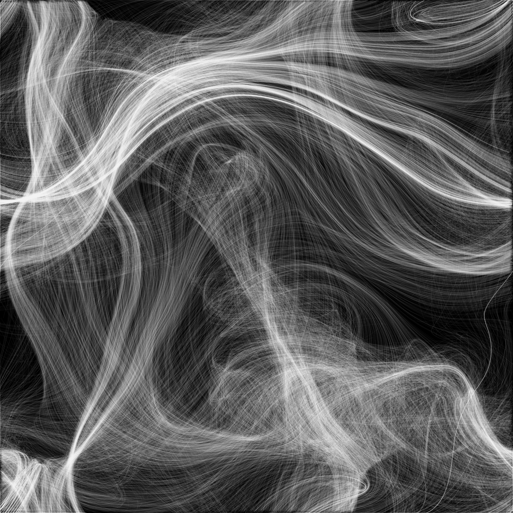

# Quiz 8

## Part 1: Imaging Technique Inspiration

### Inspiration:
I chose smoke-swirling effect as my source of inspiration. The natural flow and intricate changes in smoke’s shape are captivating, offering a sense of lightness and organic movement. I plan to use particle systems to replicate similar smoke effects in my project, adding fluidity and elegance to the visual presentation. This approach enhances the project's depth and artistic quality, making it ideal for depicting the dynamic beauty of natural phenomena. The smoke effect can enrich the project with visual depth and movement, making it more engaging and expressive.

### Example Image:
  

## Part 2: Coding Technique Exploration

### Coding Technique:
The noise flow field coding generates smooth, organic particle motion that simulates the fluid and unpredictable behavior of smoke. By guiding particle trajectories along natural paths, it effectively replicates the swirling and flowing motions of smoke. This technique enhances dynamic visual effects, adding depth and fluidity to the project. Its ability to balance randomness and smoothness makes it particularly well-suited for depicting natural phenomena, making the visuals more engaging and realistic while capturing the intricate beauty of smoke-like patterns.

### Example Link:
[View Example Code](https://miguelrr11.github.io/Noise_Flow_Field/)

### Example Screenshot:

